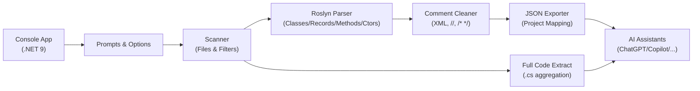

# Solution Insight for AI

[](https://dotnet.microsoft.com/)
[](#)
[](LICENSE)
[](#)
[](https://learn.microsoft.com/dotnet/csharp/roslyn-sdk/)

**Solution Insight for AI** — A .NET 9 console utility that scans a .NET solution/repository and exports a structured JSON “map” of files, types, and member signatures so AI assistants (e.g., ChatGPT/Copilot/Claude) can quickly understand and navigate your codebase without needing direct, persistent access to your repo.

---

## Table of Contents

- [Problem](#problem)
- [Solution](#solution)
- [Features (v0.3)](#features-v03)
- [Architecture](#architecture)
- [Quick Start](#quick-start)
  - [Configuration](#configuration)
  - [Interactive Session Example](#interactive-session-example)
- [Usage Playbook](#usage-playbook)
  - [Prompt Ideas](#prompt-ideas)
- [Output Schema (Project Mapping JSON)](#output-schema-project-mapping-json)
- [Privacy & Safety](#privacy--safety)
- [Troubleshooting](#troubleshooting)
- [Roadmap](#roadmap)
- [Contributing](#contributing)
- [License](#license)
- [Project Description & Topics](#project-description--topics)
- [Changelog](#changelog)

---

## Problem

- Many AI tools **cannot** directly connect to Git providers, or they impose **strict limits** on how often/how much they can index. Even when possible, indexing large repos is **slow** and **unreliable**.
- LLMs have **limited context**—even with a connection to your repo, they cannot keep the whole solution “in mind” at once.
- **Privacy & sensitivity:** pushing entire source code to an AI service may be unacceptable. Teams need to control **what** is shared.
- We need a **stable, tool-agnostic index**: a compact, structured summary (files, types, member signatures, cleaned comments) that any AI can ingest quickly, with minimal bandwidth and latency.
- Developers want **fast Q&A**: “Which methods accept `CartAddItemDto`?”, “Where is the entry point?”, “Show me the signature of XYZ” — without rescanning the repo every time.

---

## Solution

**Solution Insight for AI** builds a **versioned JSON index** (“Project Mapping”) that includes:
- A list of *important files* (`.cs`, `.cshtml`, `.html`, `.htm`, `.js`, `.css`).
- For C# source files:
  - **Class/Record** name **and full declaration signature** (e.g., `public class Foo<T>`).
  - **Method/Constructor** **full signature line** (from modifiers/return-type up to *but not including* `{`).
  - **Cleaned leading comments** as a single line (removes `///`, `//`, `/*…*/`, and XML doc tags like `<summary>`).
- **Windows-style paths** (e.g., `E:\Project\...`); in JSON, backslashes are escaped as `\\` (standard; parsed value remains `\`).
- **No HTML escaping of generics** — angle brackets `<`/`>` are preserved in signatures.

A second task, **Full Code Extract**, aggregates full `.cs` contents for troubleshooting or deeper phases; the primary focus of **v0.3** is the JSON mapping for fast AI ingestion.

---

## Features (v0.3)

- **Project Mapping (JSON)**
  - Important file listing: `.cs`, `.cshtml`, `.html`, `.htm`, `.js`, `.css`.
  - For C#: class/record **signature**, method/ctor **signature**, and **cleaned** leading comments.
  - Single, dated JSON output per run (e.g., `ProjectMapping_YYYYMMDD.json`).
  - Preserves `<`/`>` in generics; avoids `\u003C`/`\u003E`.
  - Does **not** repeat `filePath` per member; it’s declared once per file.

- **Full Code Extract**
  - Aggregates all `.cs` contents under a path (recursive optional) into one text file with separators.
  - Useful for deep dives or when AI requests full source snippets.

- **Config-driven defaults**
  - `SolutionRoot`, `DomainRoot`, `OutputRoot` via `appsettings.json`.

---

## Architecture



---

## Quick Start

> Requires **.NET 9 SDK**.

```bash
# build & run
dotnet build
dotnet run --project src/Darwin.SolutionInsightForAI.App/Darwin.SolutionInsightForAI.App.csproj
```

During startup, choose a task and accept defaults or provide custom paths via prompts.

### Configuration

Edit `appsettings.json` to set defaults (Windows-style paths):

```json
{
  "GeneratorOptions": {
    "Paths": {
      "SolutionRoot": "E:\\_Projects\\Darwin",
      "DomainRoot": "E:\\_Projects\\Darwin\\src\\Darwin.Domain",
      "OutputRoot": "E:\\_Projects\\Darwin.Files"
    },
    "Export": {
      "SchemaVersion": "1.2",
      "StripXmlDocSummaryTags": true
    }
  }
}
```

- **SolutionRoot**: default for **Project Mapping** task.  
- **DomainRoot**: default for **Full Code Extract** task.  
- **OutputRoot**: where all outputs are written (e.g., `ProjectMapping_YYYYMMDD.json`).  

> Note: In raw JSON, backslashes appear as `\\`. When parsed, they become single `\`.

### Interactive Session Example

```
=============================================
  Solution Insight for AI (Phase 1)
  .NET 9 Console Application
=============================================

Select a Task
Choose what you want the app to do.
  1. ProjectMapping
  2. FullCodeExtract
Enter number [default: ProjectMapping]: 1

Enter the path to the .NET solution or root folder [default: E:\_Projects\Darwin]:
Also extract class comments? (y/n) [default: Y]: y
Also extract method comments? (y/n) [default: N]: n

Mapping completed. Output written to:
E:\_Projects\Darwin.Files\ProjectMapping_20250925.json
```

---

## Usage Playbook

### Baseline Flow
1. **Generate the JSON map (Project Mapping)**  
   Run the app, choose *Project Mapping*, and point to your repo root (or accept defaults).
2. **Review & minimize**  
   Skim the JSON. If anything is sensitive, remove or reduce before sharing.
3. **Feed it to the AI**  
   Upload the JSON file to your AI assistant (or paste relevant parts).
4. **Iterate**  
   If the AI needs more detail for a specific module, run *Full Code Extract* for that subpath and share it.

### Prompt Ideas

- **Overview**
  > “Here is a JSON map of the solution (files, types, member signatures, cleaned comments). Please summarize the architecture and identify the key modules, entry points, and cross-cutting concerns.”

- **Find by DTO/return type**
  > “Using the JSON map, list all methods whose signatures accept `CartAddItemDto` or return `Task<Guid>`. Include file paths and containing classes.”

- **Impact analysis**
  > “Given this JSON map and this new requirement, which files and methods will likely be affected? Propose a change plan and update steps.”

- **Quality suggestions**
  > “Review the signatures and comments in the JSON map and propose naming/design improvements aligned with clean architecture.”

---

## Output Schema (Project Mapping JSON)

**File name**

```
ProjectMapping_YYYYMMDD.json
```

**Structure**

```json
{
  "schema": "darwin/project-mapping",
  "schemaVersion": "1.2",
  "generatedAtUtc": "2025-09-25T08:00:00Z",
  "root": "E:\\_Projects\\Darwin",
  "files": [
    {
      "filePath": "E\\_Projects\\Darwin\\src\\Darwin.Application\\CartCheckout\\Commands\\AddItemToCartHandler.cs",
      "members": [
        {
          "name": "AddItemToCartHandler",
          "kind": "Class",
          "signature": "public class AddItemToCartHandler",
          "summaryComment": "Adds or increases a cart line. Computes/validates add-on pricing and merges lines with identical configurations."
        },
        {
          "name": "AddItemToCartHandler",
          "kind": "Method",
          "signature": "public AddItemToCartHandler(IAppDbContext db, IAddOnPricingService addOnPricing)",
          "summaryComment": ""
        },
        {
          "name": "HandleAsync",
          "kind": "Method",
          "signature": "public async Task<Guid> HandleAsync(CartAddItemDto dto, CancellationToken ct = default)",
          "summaryComment": ""
        }
      ]
    }
  ]
}
```

**Notes**
- `filePath` appears **once per file**; members do **not** repeat it.
- `signature` excludes the method/type body `{ ... }`.
- `summaryComment` is a single-line, cleaned text (no `///`, `//`, `/*…*/`, or XML tags).
- Backslashes are escaped as `\\` in raw JSON (parsed value is `\`).

---

## Privacy & Safety

- **You are responsible** for any content you upload to AI services.
- **Review outputs** and remove/minimize sensitive information before sharing externally.
- Prefer **module-scoped** exports (map only the parts the AI needs) instead of the whole solution.
- For enterprises, host the mapping internally; share only **sanitized subsets** to external tools.
- Use project-level ignore rules (future feature): e.g., exclude secrets, credentials, generated code.
- Be mindful of **licenses** and third-party code embedded in the repo when exporting.
- If you need to reference source text, first try the **Project Mapping JSON**; only when required, use
  **Full Code Extract** for the narrow subpath in question.
- Avoid including large binary assets or private data (images, PDFs, dumps) in the mapping.
- Keep your **appsettings.json** outside of VCS if it contains machine-specific or private paths.
- Consider adding a company policy section in your repo on “**LLM Usage**” (what may/may not be shared).

---

## Troubleshooting

- **Backslashes show as `\` in JSON**  
  This is correct per JSON spec for strings; parsed value is a single `\`.

- **Generics show as `\u003C` / `\u003E`**  
  v0.3 sets `JsonSerializerOptions.Encoder = JavaScriptEncoder.UnsafeRelaxedJsonEscaping`.  
  If you still see escapes, ensure this encoder is applied at the export call.

- **`AddEnvironmentVariables` not found**  
  Add packages:  
  `Microsoft.Extensions.Configuration`, `...Json`, `...EnvironmentVariables`, `...Binder`.

- **Mermaid diagrams not rendering on GitHub**  
  Use labels with newline escapes instead of HTML tags, e.g., `A["Console App\n(.NET 9)"]`.
  Ensure the code block is fenced with ```mermaid and closed properly.

- **Missing comments in output**  
  Turn on prompts accordingly: class comments (Y), method comments (Y).  
  Notes: only **leading** comments immediately above declarations are captured.

- **Missing files in mapping**  
  Only “important” extensions are listed by default (`.cs`, `.cshtml`, `.html`, `.htm`, `.js`, `.css`).  
  Extend the allow-list in code if you need more.

- **Encoding/locale issues**  
  Outputs are UTF-8. If you see mojibake, verify your editor’s encoding and font.

---

## Roadmap

- **Dependency Graph (Roslyn Semantic Model)**
  - Symbol references, call graphs, and per-project dependency trees.
  - Cross-file navigation hints for AI prompts.

- **Richer JSON Schema**
  - Accessibility (public/internal/private), static/virtual/override, attributes.
  - Namespaces, file-scoped namespaces, using directives.
  - Optional member IDs for stable cross-references.

- **Export Options**
  - YAML export alongside JSON.
  - Split-by-project/module outputs for very large solutions.
  - Optional “display paths” for human-friendly views (single `\`).

- **Performance & Filtering**
  - Parallel IO with throttling.
  - Ignore patterns (e.g., `bin/obj`, `*.designer.cs`, generated code).
  - Pluggable “important extensions” list.

- **DX Improvements**
  - CLI arguments to bypass prompts (CI-friendly).
  - Dry-run and diff mode (compare two mappings).
  - Small web viewer for browsing the JSON map.

---

## Contributing

Contributions are welcome! Please:

1. **Open an issue** describing the use case or problem first.
2. Keep code style consistent (**.NET 9**, nullable enabled).
3. Add focused tests for non-trivial changes when practical.
4. Avoid introducing breaking changes to the JSON schema without discussion.
5. Be mindful of privacy; never commit sensitive sample data.

**Dev tips**
- Prefer Roslyn APIs over regex for C# analysis.
- Keep comments in **English** inside code; user-facing docs can be localized.
- For performance, avoid loading entire large files into memory repeatedly; stream where possible.

---

## License

This project is licensed under the **MIT License**.
See the `LICENSE` file at the repository root for the full text.

---

## Project Description & Topics

**Short description (GitHub Project Settings):**
> A .NET 9 console utility that maps a .NET solution into a rich JSON index (files, type signatures, member signatures, and cleaned comments) to help AI assistants quickly understand and navigate large codebases.

**Suggested topics (comma-separated):**
`dotnet, csharp, roslyn, code-analysis, code-index, developer-tools, ai, llm, code-mapping, console-app`

---

## Changelog

### 0.3
- Project Mapping JSON is the primary output for structure.
- Preserves `<` and `>` in signatures (no HTML escaping).
- Cleans `///`, `//`, and `/*…*/` into single-line summaries.
- Avoids repeating `filePath` for each member; declared once per file.
- Adds class/record signatures to the output.
- Configuration via `appsettings.json` for default paths and export options.
